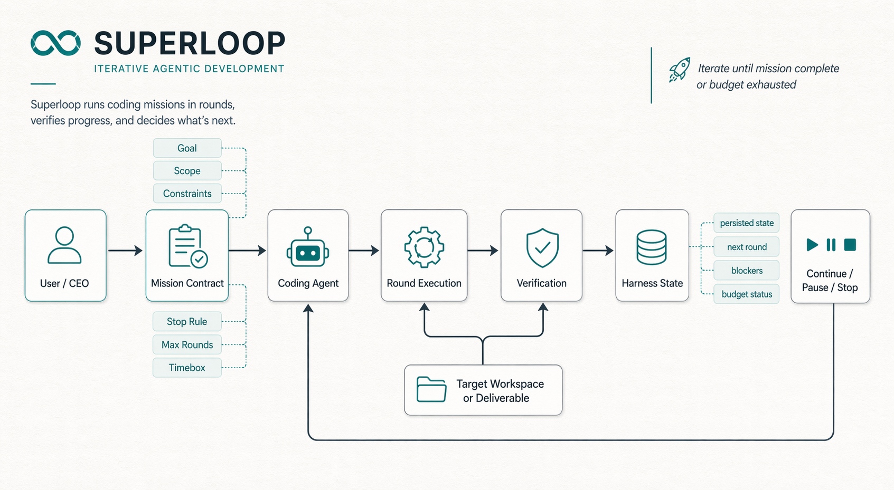

# Superloop

`superloop` is a harnessed skill for iterative vibe coding.

The core idea is simple:

- the user acts as CEO
- the coding agent acts as the execution worker
- the mission, scope, budget, and stop rule are made explicit
- the harness keeps iterating through execution rounds until the goal is achieved or the agreed round or time budget is spent

This repo includes one ready-to-run implementation for local skill environments today, but the operating model itself is tool-agnostic.

## What is in this repo

- `SKILL.md`: the main operating contract
- `agents/openai.yaml`: UI metadata for the skill picker
- `references/`: supporting docs for mission contracts, loop protocol, finish standards, workstream gates, and harness usage
- `scripts/superloop_cli.sh`: shell entrypoint for the harness
- `scripts/superloop_harness.py`: stateful harness implementation

## Architecture



Generated with GPT Image for a README-friendly overview of the runtime flow.

The runtime split is intentional:

- `SKILL.md` and `references/*` define the operating contract
- `superloop_cli.sh` is the stable shell entrypoint
- `superloop_harness.py` owns persisted state, round recording, budget tracking, and stop-audit decisions
- the target workspace stays separate from the harness state file

## Install

Clone the repo, then copy or sync it into your skills directory:

```bash
export CODEX_HOME="${CODEX_HOME:-$HOME/.codex}"
mkdir -p "$CODEX_HOME/skills/superloop"
rsync -a --delete ./ "$CODEX_HOME/skills/superloop/"
```

After that, the skill is available as `$superloop` in environments that load local skills.

## Quick start

Set the harness path:

```bash
export CODEX_HOME="${CODEX_HOME:-$HOME/.codex}"
export SUPERLOOP_HARNESS="$CODEX_HOME/skills/superloop/scripts/superloop_cli.sh"
```

Resume an existing run:

```bash
"$SUPERLOOP_HARNESS" resume --workspace /path/to/repo
```

If the ask changed in the same workspace, do not silently continue the loaded run.
Call `init` without `--continue-existing` and Superloop will archive the previous run
before it starts a fresh mission.

Initialize a new run:

```bash
"$SUPERLOOP_HARNESS" init \
  --workspace /path/to/repo \
  --goal "Ship the first usable version of this workflow" \
  --workstream "repo workflow" \
  --finish-standard workflow-ready \
  --scope "code, docs, smoke checks" \
  --max-rounds 5 \
  --timebox-minutes 90
```

Intentionally keep the same mission and merge updated contract fields:

```bash
"$SUPERLOOP_HARNESS" init \
  --workspace /path/to/repo \
  --goal "Tighten the current mission without resetting history" \
  --continue-existing
```

Preflight a risky stage:

```bash
"$SUPERLOOP_HARNESS" preflight \
  --workspace /path/to/repo \
  --stage deploy \
  --require-env VERCEL_TOKEN \
  --require-env VERCEL_PROJECT_ID \
  --optional-env SENTRY_AUTH_TOKEN
```

Record a round:

```bash
"$SUPERLOOP_HARNESS" record \
  --workspace /path/to/repo \
  --hypothesis "Simplifying setup will unblock the main path" \
  --change "remove one blocking step and update the smoke check" \
  --round-gate "A fresh run completes once without manual rescue" \
  --round-gate-result hard-pass \
  --gate-status gate-complete \
  --next-round "tighten the fallback path and verify it"
```

For terminal rounds, omit `--remaining-gap` or use a no-gap sentinel such as `none`.
The harness now normalizes common values like `none` and `no remaining gaps` so a completed
run stops cleanly instead of asking for another round.

## Contract model

The harness contract centers on:

- `Goal`
- `Finish Standard`
- `Success Signal`
- `Success Direction`
- `Current Gate`
- `Scope`
- `Constraints`
- `Stop Rule`
- `Max Rounds`
- `Timebox Minutes`

That contract is what lets the agent behave like an accountable execution worker instead of a one-shot assistant.

In practice, this behaves more like an `auto research` or `vibe coding` harness than a one-shot coding command: the CEO keeps the mission and constraints stable, the coding agent keeps shipping rounds, and the harness keeps the loop honest.

## State model

By default, the harness stores state outside the target workspace:

```text
~/.codex/state/superloop/<workspace-key>.json
```

Archived prior runs for the same workspace live under:

```text
~/.codex/state/superloop/history/<workspace-key>/
```

That lets the loop resume across turns, start a safe new mission in the same repo, and
keep old runs audit-friendly without dirtying the repo it is working on.

## When to use Superloop

Use `superloop` when you want the agent to:

- keep a mission stable across rounds
- separate `Round Gate`, `Current Gate`, and `Stop Rule`
- spend a visible round or time budget
- verify each round mechanically
- keep or discard changes based on evidence
- stop for either success, stop rule, or budget exhaustion

Do not use it for:

- narrow one-off fixes
- pure brainstorming with no execution loop
- tasks where every round still depends on repeated human intervention

## Development

Useful checks while editing this repo:

```bash
python3 -m py_compile scripts/superloop_harness.py
./scripts/superloop_cli.sh resume --workspace "$(pwd)"
```

If the second command returns a warning about missing state, that is expected for a fresh workspace.
