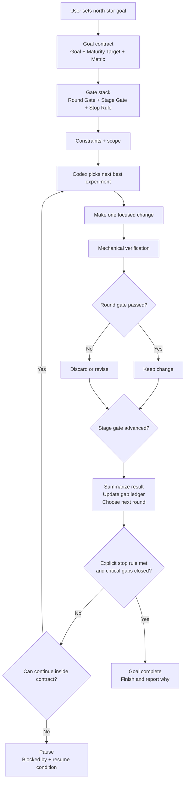
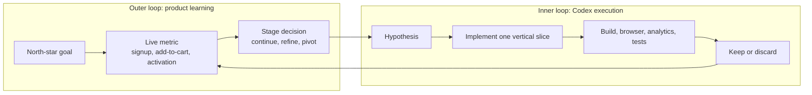
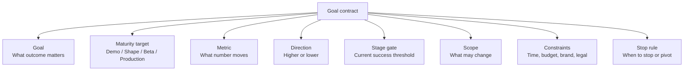
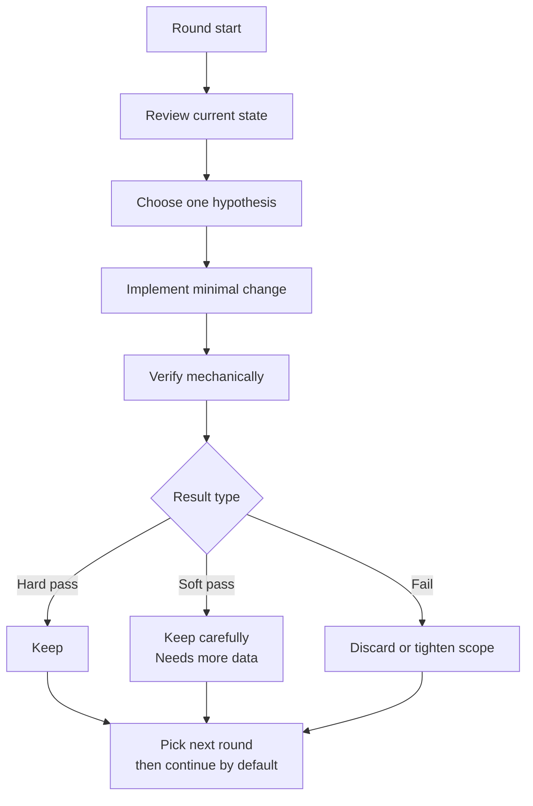
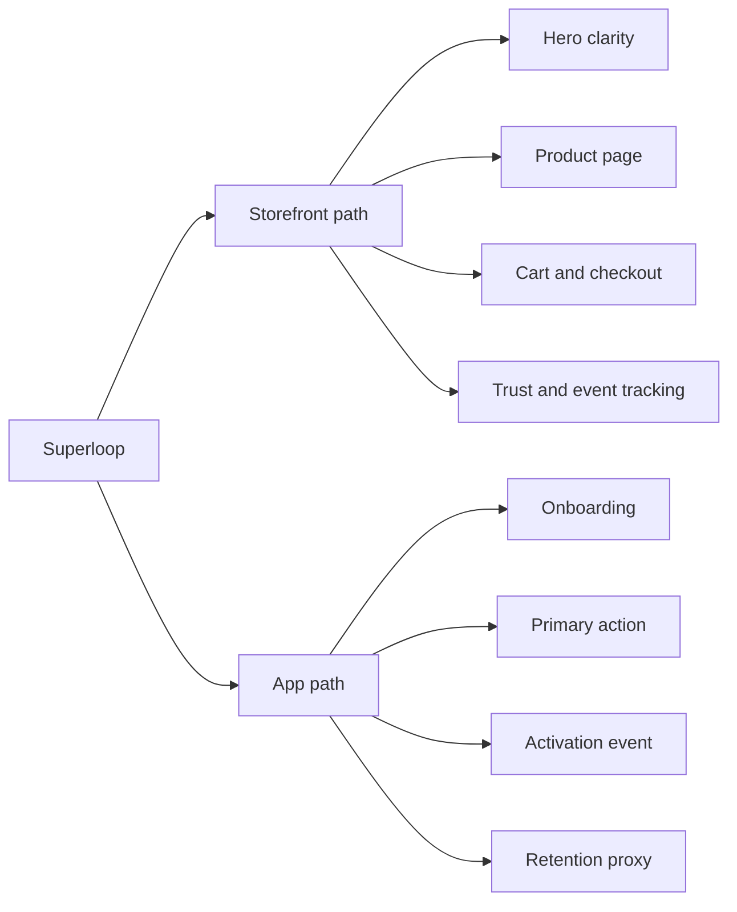

# Superloop Visual Map

Use this file when you want to explain the skill quickly to a human, align on the operating model, or show how the loop differs from a normal coding task.

## 1. Skill at a glance

## 2. Two-loop model

## 3. Goal contract

## 4. Round anatomy

## 5. Storefront vs app

## 6. Best-practice reading

- The user owns `goal`, `constraints`, and `stop rule`.
- Codex owns `path selection`, `implementation`, and `mechanical verification`.
- Calibrate the requested maturity before deciding what counts as done.
- Passing a stage gate usually promotes the next gate. It does not stop the loop by itself.
- `Round Gate`, `Stage Gate`, and `Stop Rule` are separate. Do not collapse them.
- `Gate passed?` means evidence was compared to the explicit current round gate. It is not a pure vibes call.
- `Stop condition hit?` should be evaluated from the explicit stop rule plus the remaining critical gaps for the chosen maturity target.
- If the loop cannot continue, prefer `pause + blocker + resume condition` over pretending the run is complete.
- If the metric cannot be observed yet, wire instrumentation before trying to optimize it.
- Each round should change one main variable.
- Product signals should be labeled honestly:
  - `hard pass`
  - `soft pass`
  - `needs real traffic`
  - `needs more sample`
