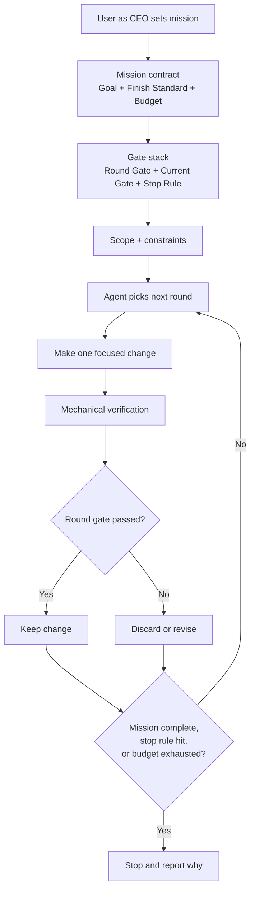
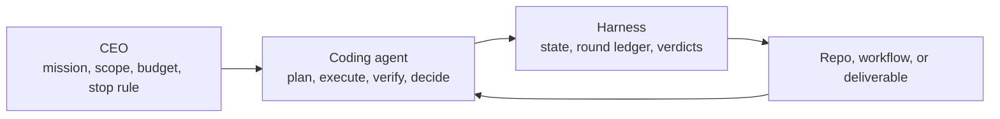
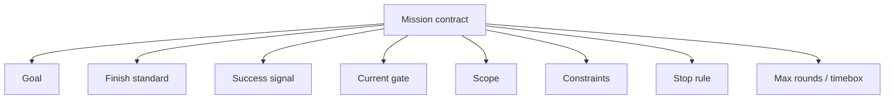
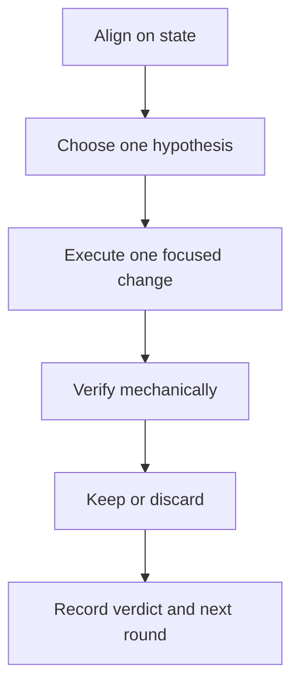

# Superloop Visual Map

Use this file when you want to explain the skill quickly to a human, align on the operating model, or show how the loop differs from a one-shot coding task.

## 1. Skill at a glance

## 2. CEO / Agent split

## 3. Mission contract

## 4. Round anatomy

## 5. Best-practice reading

- The user owns `goal`, `constraints`, `budget`, and `stop rule`.
- The agent owns `path selection`, `implementation`, and `mechanical verification`.
- The harness owns `persisted state`, `budget tracking`, and `continue / pause / stop`.
- Passing the current gate usually promotes the next gate. It does not stop the loop by itself.
- Budget exhaustion is a valid stop reason. It is not the same thing as mission complete.
- If the loop cannot continue, prefer `pause + blocker + resume condition` over pretending the run is complete.
